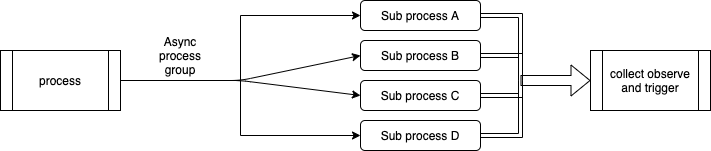

# kafka-eb-collector

Experimental Kafka event bus component that is able to collect asynchronous group events

## Approach

There are several common operations in a decentralized event system. One of them is that one event triggers multiple async events followed by a state that is waiting for the result of all of the triggered events.

In some programming languages there exist a similar technique to collect the result of parallel thread routines.

golang:

    func main() {
        var wg sync.WaitGroup

        for i := 1; i <= 5; i++ {
            wg.Add(1)
            go worker(i, &wg)
        }

        wg.Wait()
    }

c++

    boost::thread_group

node

    Promise.all([p1, p2, p3]).then((v) => {
        resolved(v);
    })

## Examples

Example rest calls to ignite the group event

**POST** /create

* id:
    Unique id (e.g. uuid v4). This id will be used for the referencing pieces as groupid
* description:
    Optional description text
* payload:
    Optional agnostic payload that will be commited on success and failure events
* expected:
    List of expected ids of the pieces that need to be finished for the group policy. This is optional and refered as strict mode
* handler:
    Handler for group resolving. Success and failure are propagating into the collector topic by default. You can define additional propagation targets

Example:

    {
        "id": "F0CABCA1-64AE-40A3-ABEB-0741ACF1FF81",
        "description": "optional description",
        "payload": {},
        "expected": [
            "A0CABCA1-64AE-40A3-ABEB-0741ACF1FF81",
            "B0CABCA1-64AE-40A3-ABEB-0741ACF1FF81",
            "C0CABCA1-64AE-40A3-ABEB-0741ACF1FF81"
        ],
        "handler": {
            "onsuccess": {
                "topic": "special_topic",
                "payload": {}
            },
            "onfailure": {
                "topic": "special_failure_topic",
                "payload": {}
            }
        }
    }
